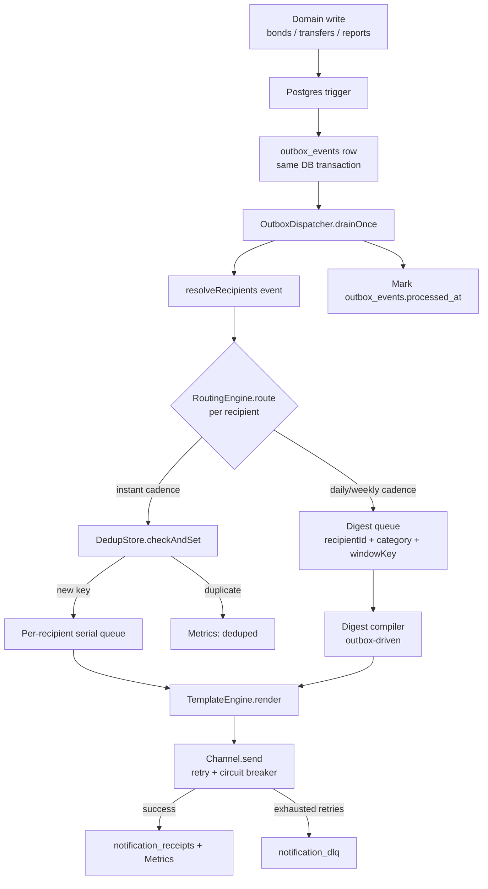

# Notification Platform Architecture

This document describes the **as-built architecture** for **issue #37**: an additive expansion of VELAR's existing minimal in-app notification system into an event-driven, multi-channel notification and delivery platform. It was written first as the design artifact; implementation followed it closely (276 backend tests, full frontend inbox/preference center). The design builds on what already ships today—`notifications` table, `NotificationsService`, `NotificationBell` polling—without replacing those code paths. New tables, Postgres triggers, and application-layer pipeline components wrap around domain writes to provide reliable capture, routing, fan-out, retries, and observability.

**Implementation deviations from this design (intentional):**

- **`event_type` strings** use the domain's Spanish status literals (e.g. `bond.congelado`, `transfer.aceptada`, `report.enviado`) rather than the English aliases shown in some trigger examples below—the triggers derive `event_type` as `'<aggregate>.' || NEW.status`.
- **`DigestQueue.enqueue`** carries an explicit `windowEndsAt` (ISO-8601 end of the digest/quiet-hours window) in addition to the window key.
- **`notification_digest_queue` table + `DigestCompiler`** were added in a follow-up migration (`20260703000000_notification_digest_queue.sql`) after the original schema section was drafted; see §Schema and §Application-Layer Pipeline.
- **Audit gap-fills** called out under Explicit Non-Goals were completed during implementation (`requestBond`, `rejectReturn`, `ReportsService.create`/`review`).

---

## Current State

### Database and service layer

VELAR today persists notifications in a flat `notifications` table (migration `20260608000000_notifications.sql`):

| Column | Purpose |
|--------|---------|
| `id` | UUID primary key |
| `user_id` | Recipient (`profiles.id`) |
| `type` | Free-text notification type (e.g. `offer_received`, `bond_approved`) |
| `payload` | JSONB event context |
| `read` | Boolean unread flag |
| `created_at` | Insert timestamp |

Row Level Security uses a single owner policy (`notifications_owner`): authenticated users may read and update only rows where `user_id = auth.uid()`.

### `NotificationsService` (`apps/api/src/notifications/notifications.service.ts`)

- **`emit(userId, type, payload)`** — Inserts a row via the backend's Supabase **service_role** client (`supabase.admin`). **Fire-and-forget**: wraps the insert in `try/catch`, logs a warning on failure, and **never rethrows**, so a notification failure cannot break the calling business flow.
- **`list(userId, limit)`** — Returns recent notifications plus an unread count.
- **`markRead(id, userId)`** / **`markAllRead(userId)`** — Update the boolean `read` column, scoped with `.eq('user_id', userId)`.

### `NotificationsController` (`apps/api/src/notifications/notifications.controller.ts`)

Exposes three authenticated endpoints behind `AuthGuard` + `@CurrentUser()`:

- `GET /notifications` → `list`
- `PATCH /notifications/:id/read` → `markRead`
- `PATCH /notifications/read-all` → `markAllRead`

### Frontend: `NotificationBell.tsx` (`apps/web/components/NotificationBell.tsx`)

The shell chrome polls `GET /notifications` every **30 seconds** (`setInterval(..., 30_000)`), refreshes on panel open, and silently ignores fetch failures so the bell never breaks the layout. There is no WebSocket or SSE transport today.

### Audit trail contrast: `AuditService` (`apps/api/src/audit/audit.service.ts`)

`AuditService.emit()` writes append-only rows to `audit_events`. A Postgres trigger (`trg_audit_events_immutable`) blocks `UPDATE` and `DELETE` on that table. Unlike `NotificationsService.emit()`, **`AuditService.emit()` does not swallow errors**—insert failures propagate to the caller.

### Critical app-layer constraint: no database transactions

Every domain service (`BondsService`, `TransfersService`, `ReportsService`, etc.) performs writes through raw **`@supabase/supabase-js`** calls—typically sequential `.from(...).insert()` / `.update()` statements on the admin client. The codebase has:

- **No** `.rpc()` usage for multi-statement workflows
- **No** application-level transaction API (no `BEGIN`/`COMMIT` wrapper)

A domain method that updates `bonds` and then separately inserts into `notifications` or `audit_events` has **no atomicity guarantee** if the second call fails. This constraint is the primary driver for capturing notification intent via **Postgres triggers in the same transaction as the domain write**, rather than relying on post-hoc `NotificationsService.emit()` calls alone.

---

## Goals

The expanded platform must deliver the following capabilities. Every behavior below must be verifiable in CI using **in-memory fakes** and **property-based tests**, with **zero external infrastructure** (no live Postgres, no email provider, no Web Push credentials) required for `npm run test` in `apps/api`.

| Area | Goal |
|------|------|
| **Reliable capture** | Transactional outbox: domain events recorded atomically with the write that caused them |
| **Fan-out** | Idempotent multi-channel delivery with per-recipient ordering, backpressure, exponential-backoff retry, DLQ, and per-channel circuit breakers |
| **Routing** | Rule-based preference engine: category/channel opt-outs, DST-correct quiet hours, digest cadence (instant / daily / weekly) |
| **Templates** | Versioned template engine with i18n, XSS-safe HTML sanitization, and A/B variant support |
| **Transport** | Resumable realtime delivery (WebSocket) plus in-app polling compatibility |
| **Observability** | Metrics and tracing hooks at each pipeline stage |
| **Security** | Reuse existing auth guards, dual-layer RLS + app filters, global throttling |
| **Frontend** | Richer notification UX (categories, severity, read timestamps, archive) without breaking existing bell behavior |

---

## Outbox Capture via Postgres Triggers

### Why triggers instead of service-layer emit

Because the application layer cannot wrap multiple Supabase calls in a single database transaction, any `NotificationsService.emit()` invoked **after** a domain `.update()` is best-effort only—the bond/transfer/report row may commit while the notification insert fails silently.

**Postgres `AFTER INSERT` / `AFTER UPDATE` triggers** run inside the **same database transaction** as the triggering statement automatically. When `BondsService` executes `.from('bonds').update({ status: 'congelado' })`, a trigger firing on that row sees committed-or-rolled-back state together with the status change—**with zero changes to existing service call sequencing**.

Triggers write rows to `outbox_events`. They **do not** resolve recipients, apply preferences, or render templates—that is entirely the application-layer **Routing Engine** (see §6).

Each trigger computes a **deterministic `dedup_key`** (defense-in-depth against duplicate outbox rows; primary idempotency for delivery uses the application-layer `DedupStore` described later).

### RLS recursion lesson

This repository previously hit **"infinite recursion detected in policy for relation profiles"** when an RLS policy on `profiles` contained `EXISTS (SELECT … FROM profiles …)`. The fix lives in `20260602000001_fix_profiles_rls_recursion.sql`: a `public.auth_role()` **`SECURITY DEFINER`** helper reads the current user's role without re-entering RLS.

**All new RLS policies introduced by this platform MUST use `public.auth_role()` for role checks—never inline self-referencing `EXISTS` subqueries on `profiles`.**

### Trigger: `trg_bonds_outbox`

| Firing condition | `event_type` | Notes |
|------------------|--------------|-------|
| `AFTER INSERT` on `bonds` | `bond.created` | New bond row |
| `AFTER UPDATE` when `OLD.status IS DISTINCT FROM NEW.status` | Derived from `NEW.status` | e.g. `bond.frozen` (`congelado`), `bond.unfrozen` (leaving `congelado`), `bond.published` (`en_venta`) |

**Payload** (JSONB):

```json
{
  "tokenId": "<bonds.token_id>",
  "currentOwner": "<bonds.current_owner>",
  "issuerPartyId": "<bonds.issuer_party_id>",
  "previousStatus": "<OLD.status>",
  "newStatus": "<NEW.status>"
}
```

**`dedup_key` example:** `bond:{tokenId}:{event_type}:{occurred_at_truncated_to_ms}` or a hash of `(aggregate_type, aggregate_id, event_type, previousStatus, newStatus, txid)`—exact formula chosen at implementation time but must be deterministic for identical transitions.

### Trigger: `trg_transfers_outbox`

| Firing condition | `event_type` |
|------------------|--------------|
| `AFTER INSERT` on `transfers` | `transfer.requested` |
| `AFTER UPDATE` when `OLD.status IS DISTINCT FROM NEW.status` | Status-derived types (see below) |

**Status → event_type mapping** (representative):

| `NEW.status` | `event_type` |
|--------------|--------------|
| `aceptada` | `transfer.accepted` |
| `rechazada` | `transfer.rejected` |
| `en_escrow` | `transfer.escrow_locked` |
| `pago_registrado` | `transfer.payment_registered` |
| `pago_validado` | `transfer.payment_validated` |
| `liberada` | `transfer.released` |
| `cancelada` | `transfer.cancelled` |
| *(return lifecycle)* | `transfer.return_requested`, `transfer.return_approved`, `transfer.return_rejected` |

**Payload** (JSONB):

```json
{
  "fromOwner": "<transfers.from_owner>",
  "toOwner": "<transfers.to_owner>",
  "bondTokenId": "<transfers.bond_token_id>",
  "previousStatus": "<OLD.status>",
  "newStatus": "<NEW.status>"
}
```

**Escrow coverage:** There is no separate escrow domain table. Escrow state in VELAR manifests as `transfers.status` transitions (`aceptada` → `en_escrow` → `pago_registrado` → `pago_validado` → `liberada`). The module under `apps/api/src/escrow/*` (`trustless-work.service.ts`, `stellar-bond.service.ts`, etc.) consists of **pure on-chain RPC wrappers**; the only related domain-table write outside `transfers` is an unrelated `custody_wallets` table in `wallet.service.ts`. Instrumenting `transfers` alone transparently captures the full escrow notification surface.

### Trigger: `trg_reports_outbox`

| Firing condition | `event_type` |
|------------------|--------------|
| `AFTER UPDATE` on `reports` when `OLD.status IS DISTINCT FROM NEW.status` | Status-derived (see below) |

**Status → event_type mapping:**

| Transition into `NEW.status` | `event_type` |
|------------------------------|--------------|
| `enviado` | `report.submitted` |
| `reenviado` | `report.resubmitted` |
| `observado` | `report.observed` |
| `aprobado` | `report.approved` |

Two separate services write `reports.status` today:

- **`ReportsService.review()`** (legacy path in `reports.service.ts`)
- **`ReportLifecycleService.submit()`** (compliance path in `report-lifecycle.service.ts`)

A **single table-level trigger** covers both without knowing which service performed the write.

**Payload** includes `reportId`, `partyId`, `previousStatus`, `newStatus`, and relevant metadata (period, version).

---

## Schema

All DDL lives in a **new append-only migration**:

`supabase/migrations/20260702000000_notification_platform.sql`

**Never edit** the already-applied `20260608000000_notifications.sql`; extend via `ALTER TABLE` in the new file only.

### `outbox_events`

Transactional outbox queue consumed by the application dispatcher.

| Column | Type | Purpose |
|--------|------|---------|
| `id` | `uuid` PK | Row identity |
| `aggregate_type` | `text` | `bond`, `transfer`, `report` |
| `aggregate_id` | `uuid` | PK of source row |
| `event_type` | `text` | e.g. `bond.frozen`, `transfer.accepted` |
| `payload` | `jsonb` | Trigger-built event body |
| `occurred_at` | `timestamptz` DEFAULT `now()` | Event timestamp; partition key |
| `dedup_key` | `text` UNIQUE | Deterministic defense-in-depth key |
| `processed_at` | `timestamptz` NULL | Set when dispatcher finishes |
| `attempts` | `int` DEFAULT `0` | Processing attempt counter |
| `last_error` | `text` NULL | Last failure message |

**Partitioning:** `RANGE` partitioned by `occurred_at` (monthly). Because this is a brand-new table, partitioning is declared at `CREATE TABLE` time.

**Future partition provisioning** (documented maintenance snippet—not a live cron in this design):

```sql
-- Run at the start of each month (or via external scheduler) to add the next partition.
CREATE TABLE IF NOT EXISTS outbox_events_2026_08
  PARTITION OF outbox_events
  FOR VALUES FROM ('2026-08-01') TO ('2026-09-01');
```

Repeat with adjusted bounds for each month. The parent table definition uses `PARTITION BY RANGE (occurred_at)`.

### `notification_dedup`

Application-layer idempotency store for delivered notifications.

| Column | Type | Purpose |
|--------|------|---------|
| `idempotency_key` | `text` PK | `hash(dedupKey, recipientId, channel)` |
| `recipient_id` | `uuid` | Target user |
| `channel` | `text` | `in_app`, `email_digest`, `web_push`, … |
| `created_at` | `timestamptz` DEFAULT `now()` | First-seen time |
| `expires_at` | `timestamptz` | TTL for key eviction |

### `notification_preferences`

Per-user category × channel opt-in/opt-out.

| Column | Type | Purpose |
|--------|------|---------|
| `user_id` | `uuid` | Owner |
| `category` | `text` | e.g. `transfers`, `bonds`, `reports` |
| `channel` | `text` | Delivery channel |
| `enabled` | `boolean` DEFAULT `true` | Opt-out flag |
| `updated_at` | `timestamptz` | Last change |

**PK:** `(user_id, category, channel)`

### `notification_quiet_hours`

DST-correct do-not-disturb windows.

| Column | Type | Purpose |
|--------|------|---------|
| `user_id` | `uuid` PK | Owner |
| `timezone` | `text` NOT NULL | IANA zone (e.g. `America/Costa_Rica`) |
| `start_minute` | `int` | Minutes from midnight (0–1439) |
| `end_minute` | `int` | Minutes from midnight (0–1439); may wrap midnight |
| `days` | `smallint[]` DEFAULT `'{0,1,2,3,4,5,6}'` | Day indices, 0 = Sunday .. 6 = Saturday (JS `Date.getDay()` convention, not ISO weekday) |

### `notification_digest_settings`

Digest cadence per category.

| Column | Type | Purpose |
|--------|------|---------|
| `user_id` | `uuid` | Owner |
| `category` | `text` | Notification category |
| `cadence` | `text` DEFAULT `'instant'` | `instant`, `daily`, `weekly` |

**PK:** `(user_id, category)`

### `notification_digest_queue`

Pending digest items coalesced by the application-layer **`DigestCompiler`** (migration `20260703000000_notification_digest_queue.sql`; not in the original schema draft).

| Column | Type | Purpose |
|--------|------|---------|
| `id` | `uuid` PK | Row identity |
| `recipient_id` | `uuid` | Target user |
| `category` | `text` | Notification category |
| `window_key` | `text` | Digest window identifier from routing |
| `window_ends_at` | `timestamptz` | When the window closes; compiler polls `WHERE compiled_at IS NULL AND window_ends_at <= now()` |
| `rendered_subject` | `text` | Pre-rendered subject for this queued item |
| `rendered_body` | `text` | Pre-rendered body for this queued item |
| `channel` | `text` | Intended delivery channel |
| `created_at` | `timestamptz` DEFAULT `now()` | Enqueue time |
| `compiled_at` | `timestamptz` NULL | Set when rolled into a digest send |

**RLS:** enabled, **no policy for `authenticated`** — backend-internal, same pattern as `outbox_events`.

**Indexes:** partial `idx_digest_queue_pending` on `(window_ends_at) WHERE compiled_at IS NULL`; `idx_digest_queue_recipient` on `(recipient_id, category, window_key)`.

### `notification_receipts`

Per-channel delivery audit trail for a notification row.

| Column | Type | Purpose |
|--------|------|---------|
| `id` | `uuid` PK | Receipt identity |
| `notification_id` | `uuid` FK → `notifications(id)` | Parent notification |
| `channel` | `text` | Channel used |
| `status` | `text` | `pending`, `delivered`, `failed`, … |
| `attempt_count` | `int` DEFAULT `0` | Send attempts |
| `delivered_at` | `timestamptz` NULL | Success time |
| `read_at` | `timestamptz` NULL | Channel-specific read (if applicable) |
| `error` | `text` NULL | Failure detail |

### `notification_dlq`

Dead-letter queue for exhausted retries.

| Column | Type | Purpose |
|--------|------|---------|
| `id` | `uuid` PK | DLQ row |
| `outbox_event_id` | `uuid` | Source outbox event |
| `recipient_id` | `uuid` | Intended recipient |
| `channel` | `text` | Failed channel |
| `payload` | `jsonb` | Rendered or pre-render payload |
| `failure_reason` | `text` | Terminal error |
| `failed_at` | `timestamptz` DEFAULT `now()` | DLQ insertion time |
| `retry_count` | `int` | Attempts before DLQ |

### `notifications_archive`

Mirrors the `notifications` table schema. Destination for rows moved after the retention window.

### Additive columns on existing `notifications`

Applied via `ALTER TABLE notifications ADD COLUMN …` in the new migration only:

| Column | Type | Default | Purpose |
|--------|------|---------|---------|
| `category` | `text` | NULL | Routing category |
| `severity` | `text` | `'info'` | `info`, `warning`, `critical` |
| `read_at` | `timestamptz` | NULL | Precise read timestamp |
| `archived_at` | `timestamptz` | NULL | Soft-archive marker |
| `idempotency_key` | `text` | NULL | Links to dedup store |
| `channel` | `text` | `'in_app'` | Originating channel |

The existing boolean `read` column and **`NotificationsService.list` / `markRead` / `markAllRead` remain unmodified**. New pipeline code sets **`read` and `read_at` together** when marking read.

### Row Level Security

| Table group | Policy |
|-------------|--------|
| **User-facing:** `notification_preferences`, `notification_quiet_hours`, `notification_digest_settings` | Owner-only `FOR ALL TO authenticated` matching `notifications_owner`: `user_id = auth.uid()` for both `USING` and `WITH CHECK` |
| **Backend-internal:** `outbox_events`, `notification_dedup`, `notification_dlq`, `notification_receipts`, `notification_digest_queue` | RLS **enabled**, **no policy for `authenticated`** → default deny. Only the backend **service_role** key (which bypasses RLS) may read/write, consistent with `audit_events` and backend-managed `notifications` inserts today |

Any new policy that checks user role must call **`public.auth_role()`**, not self-referencing subqueries on `profiles`.

### Indexing

```sql
CREATE INDEX idx_outbox_unprocessed
  ON outbox_events (occurred_at)
  WHERE processed_at IS NULL;
```

Partial index optimized for `OutboxDispatcher` poll: `WHERE processed_at IS NULL ORDER BY occurred_at LIMIT n`.

Additional standard indexes on FK/lookup columns:

- `notification_dedup(recipient_id)`
- `notification_receipts(notification_id)`
- `notification_dlq(recipient_id)`, `notification_dlq(outbox_event_id)`
- `notification_preferences(user_id)`, `notification_quiet_hours(user_id)`, `notification_digest_settings(user_id)`
- `notifications(idempotency_key)` where not null
- `notifications(archived_at)` where null (hot set)

### Archival strategy

`archived_at` on `notifications` marks a row as soft-archived; it no longer appears in default `list()` queries once the service is extended to filter `archived_at IS NULL`.

A **documented maintenance job** (not necessarily live-scheduled in this design) periodically:

1. Selects rows where `archived_at IS NOT NULL` and `archived_at < now() - retention_interval`
2. Inserts them into `notifications_archive`
3. Deletes (or hard-archives) from `notifications`

Retention interval is configurable; default suggestion: 90 days after archive marking.

---

## Application-Layer Pipeline

### Directory layout

```
apps/api/src/notifications/
├── domain/
│   ├── outbox.interface.ts
│   ├── dedup.interface.ts
│   ├── channel.interface.ts
│   ├── transport.interface.ts
│   ├── template.interface.ts
│   ├── observability.interface.ts
│   └── recipients.ts
├── outbox/
│   ├── in-memory-outbox.store.ts
│   ├── postgres-outbox.store.ts
│   ├── dispatcher.ts
│   ├── retry.ts
│   └── circuit-breaker.ts
├── dedup/
│   ├── in-memory-dedup.store.ts
│   └── postgres-dedup.store.ts
├── routing/
│   ├── routing-engine.ts
│   ├── quiet-hours.ts
│   ├── digest-window.ts
│   ├── digest-compiler.ts
│   ├── digest-queue-reader.ts
│   └── postgres-digest-queue.ts
├── channels/
│   ├── in-app.channel.ts
│   ├── email-digest.channel.ts
│   └── web-push.channel.ts
├── templates/
│   ├── template-engine.ts
│   └── sanitize.ts
├── transport/
│   ├── in-memory-transport.ts
│   └── websocket-transport.ts
├── observability/
│   ├── metrics.ts
│   └── tracing.ts
├── notifications.service.ts      # extended; emit/list/markRead/markAllRead signatures unchanged
├── notifications.controller.ts   # extended
├── notifications.module.ts       # extended
├── preferences.service.ts        # new
└── preferences.controller.ts     # new
```

### End-to-end event flow



**Prose walkthrough:**

1. **Domain write** — An existing service method updates `bonds`, `transfers`, or `reports` via `supabase.admin` (unchanged call pattern).

2. **Trigger → outbox** — The corresponding trigger inserts one `outbox_events` row in the **same transaction**. If the domain write rolls back, the outbox row rolls back too.

3. **Dispatch poll** — `OutboxDispatcher.drainOnce()` (invoked by tests, a Nest lifecycle hook, or an external scheduler) queries unprocessed rows using `idx_outbox_unprocessed`, fetches a bounded batch, and processes each event.

4. **Recipient resolution** — `resolveRecipients(event)` is a **pure function** keyed by `(aggregate_type, event_type)`:
   - `bond.frozen` → `[payload.currentOwner]`
   - `transfer.accepted` → `[payload.toOwner]`
   - `transfer.requested` → `[payload.fromOwner, payload.toOwner]` (both parties, subject to preferences)
   - `report.observed` → party submitters + TSE watchers (rules defined in `recipients.ts`)

5. **Routing** — For each recipient, `RoutingEngine.route()` (pure function) reads `notification_preferences`, `notification_quiet_hours`, and `notification_digest_settings` and returns zero or more routing decisions: `{ channel, cadence, deliverAt, digestWindowKey }`.
   - Quiet hours defer `deliverAt` to the next allowed window (computed with **luxon** for DST correctness).
   - Disabled category/channel pairs are filtered out.

6. **Instant cadence path** — Idempotency key = `hash(event.dedupKey, recipientId, channel)`. `DedupStore.checkAndSet(key)`:
   - If key already exists → increment dedup metric, skip delivery.
   - If new → enqueue work on a **per-recipient serial queue** (ordering guarantee: different recipients process concurrently; the same recipient processes strictly in event order).

7. **Render and deliver** — `TemplateEngine.render()` produces channel-specific content (sanitized via `sanitize-html`). `NotificationChannel.send()` is wrapped by:
   - **`retry.ts`** — Exponential backoff with full jitter
   - **`circuit-breaker.ts`** — Per-channel closed / open / half-open states

8. **Outcomes** — Success writes `notification_receipts` and the in-app channel also inserts/updates `notifications`. Exhausted retries write `notification_dlq`. `MetricsRecorder` emits counters/histograms at each stage (emitted, delivered, deduped, failed, latency, DLQ depth).

9. **Mark processed** — After all recipients for an outbox event are handled (or permanently DLQ'd), set `outbox_events.processed_at`.

10. **Digest cadence path** — For `daily` or `weekly` cadence, routing appends the decision to a **digest queue** keyed by `(recipientId, category, digestWindowKey)` instead of delivering immediately. `DigestQueue.enqueue()` persists each item to `notification_digest_queue` with `windowEndsAt` set from `RoutingDecision.deliverAt`.

### `DigestCompiler` (`routing/digest-compiler.ts`)

Separate from the outbox dispatcher poll. **`DigestCompiler.compileDue(now)`** (invoked by `DispatcherRunnerService` alongside `OutboxDispatcher.drainOnce()`):

1. Fetches due rows from `notification_digest_queue` via `DigestQueueReader.fetchDue(now)` (`window_ends_at <= now`, `compiled_at IS NULL`).
2. Groups by `(recipientId, category, windowKey, channel)`.
3. Renders a coalesced message through template `notification.digest` with the queued subjects as `items`.
4. Sends via the same `NotificationChannel` stack; on success, `markCompiled()` on the source rows and increments delivery metrics.

Production would also schedule this on an interval (`@nestjs/schedule` or external cron); tests use `InMemoryDigestQueueReader` with no Postgres.

### Backpressure

- **Per-recipient queues** are bounded by a **global concurrency limiter** (semaphore). When at capacity, the dispatcher stops dequeuing new per-recipient work until a slot frees.
- If the **outbox backlog** exceeds a configurable threshold, `drainOnce()` finishes the **current batch** before fetching the next—preventing unbounded memory growth. This behavior is documented and covered by dispatcher concurrency tests; no live scheduler infrastructure is required to verify it.

---

## Testability Contract

Every interface under `domain/` has a corresponding **in-memory fake** used by the full test suite:

| Interface | In-memory implementation | Test focus |
|-----------|-------------------------|------------|
| `OutboxStore` | `in-memory-outbox.store.ts` | Dispatcher batching, processing markers |
| `DedupStore` | `in-memory-dedup.store.ts` | Idempotency, TTL expiry |
| `NotificationChannel` | channel fakes / stubs | Retry, circuit breaker integration |
| `Transport` | `in-memory-transport.ts` | WebSocket resume, fan-out |
| `TemplateEngine` | direct unit tests + snapshots | i18n, sanitization, A/B variants |
| `MetricsRecorder` | in-memory collector | SLI assertions |

Postgres-backed stores (`postgres-outbox.store.ts`, `postgres-dedup.store.ts`) implement the same interfaces for production but are **never required for tests to pass**.

**CI requirement:** `npm run test` in `apps/api` **must succeed with no `SUPABASE_*` environment variables set.**

Property-based tests (`fast-check`) cover:

- Routing engine (quiet hours edge cases, preference combinations)
- Dispatcher ordering and concurrency
- Template rendering invariants (output always XSS-safe)
- Dedup key collision resistance

---

## Security & Observability

### Authorization

Reuse the existing Nest patterns—**do not reinvent auth**:

- `AuthGuard` on all user-facing controllers
- `RolesGuard` + `@Roles(...)` where TSE/admin-only operations are needed (preferences are owner-scoped; admin overrides follow existing module conventions)
- `@CurrentUser()` decorator for the authenticated profile

### Dual-layer isolation

The backend uses the **service_role** Supabase key, which **bypasses RLS**. Therefore every query that reads or mutates user-specific data must **also** filter at the application layer with `.eq('user_id', userId)` (matching the pattern in `NotificationsService.markRead` and elsewhere). RLS owner policies on preference tables provide defense-in-depth for any future direct client access.

### Rate limiting

Reuse the globally configured **`@nestjs/throttler` `ThrottlerModule`** in `app.module.ts` (`ThrottlerGuard` as `APP_GUARD`) for HTTP endpoints. Separately, the outbox dispatcher applies an optional **per-recipient+channel** in-process fixed-window abuse guard (`RateLimiter` / `InMemoryRateLimiter`). When a key is exhausted, the delivery is dead-lettered with `failureReason: 'rate_limited'` (same DLQ as delivery failures) and counted via `incrementRateLimited` rather than `incrementFailed`.

### Payload signing

Outbound email and web-push payloads support optional **HMAC-SHA256** signing via an injectable `PayloadSigner` (`HmacPayloadSigner`). When no signing secret is configured, channels default to `NoopPayloadSigner` so the platform still runs with no external provider credentials.

### Tracing

Tracing is behind a `Tracer` interface with a **no-op default** (`NoopTracer`) — no OpenTelemetry or vendor lock-in. An optional `ConsoleTracer` emits structured debug lines for local debugging.

### Service Level Indicators (SLIs)

| SLI | Definition |
|-----|------------|
| **Delivery success rate** | `delivered / (delivered + failed)` per channel |
| **Delivery latency** | p50 / p95 / p99 (and avg) per channel from recorded delivery latencies |
| **DLQ depth** | Current depth reported by `MetricsRecorder.setDlqDepth` |
| **Dedup rate** | `deduped / (delivered + deduped)` — indicates duplicate trigger or retry noise |

`GET /notifications/admin/metrics` (tse/admin only) exposes a live snapshot of these SLIs: emitted (per eventType), delivered / deduped / failed / rateLimited / latency percentiles (per channel), and `dlqDepth`.

`MetricsRecorder` and the `Tracer` hooks are consumed by tests; production wiring to an external metrics/tracing backend is out of scope for issue #37.

---

## New Dependencies

Added to `apps/api` `package.json`:

| Package | Kind | Purpose |
|---------|------|---------|
| **`luxon`** | dependency | DST-correct timezone math for quiet hours and digest windows. Node's built-in `Intl` API alone is insufficient for robust recurring-window calculations across DST transitions. |
| **`sanitize-html`** | dependency | XSS sanitization in the template engine. Node-native; no jsdom required (unlike dompurify). |
| **`fast-check`** | devDependency | Property-based testing for routing, dispatcher, and dedup invariants. |

---

## Explicit Non-Goals / Scope Boundary

This architecture document **does not** propose:

- Replacing **`AuditService`** or changing its append-only semantics
- Replacing or breaking **`NotificationsService.emit()`**, **`list()`**, **`markRead()`**, or **`markAllRead()`** — signatures and existing behavior stay intact
- Rewriting any currently-working code path; only **new tables/files** plus **small additive gap-fills**

**Audit gap-fills (completed during #37 implementation):** Additive `AuditService.emit()` calls were added to `BondsService.requestBond()`, `TransfersService.rejectReturn()`, and `ReportsService.create()` / `review()` — matching sibling methods in the same files.
